# Resume

```
✨ 어제보다 오늘이 나은 개발자
```


# 이동영

---

### 소개

- Swift를 좋아합니다.
- 읽기 좋은 코드를 작성하기위해 노력합니다.
- 비슷한 것들을 구분하려 노력합니다.
- 생각에 대해 이야기를 하는 것을 좋아합니다.
- 이야기와 공유가 저를 성장시킨다고 믿고 있습니다.

### 학력

- 성공회대학교 - 컴퓨터 공학과
- 코드스쿼드 iOS 마스터즈 코스

### 프로젝트

- **[iOS앱] 스토어 앱**
    - 소개
        - 배민찬과 동일한 화면 구성을 가진 쇼핑 주문 앱
    - 주요 기능
        - 메뉴 목록 표시
    - 개발 범위
        - 네트워크 병렬 처리
    - 라이브러리
        - Toaster
        - SnapKit
        - Then
    - 개발 언어
        - Swift
    - GitHub 저장소
        - [https://github.com/O-O-wl/store-app](https://github.com/O-O-wl/store-app)
    - 실행 화면
        - 

- **[iOS앱] 주소록 앱**
    - 소개
        - 기본 연락처 앱과 연동 / 검색이 가능한 주소록 앱
    - 주요 기능
        - 연락처 정보를 화면에 표시
        - 자음 별 섹션 분류 / 인덱스 타이틀 표현
        - 검색(초성 검색 포함)에 따른 필터링
    - 개발 범위
        - 연락처 정보를 가져오는 동안의 대기시간을 고려한 GCD 큐를 이용한 처리
        - 데이터를 가져오는 시점과 와 뷰의 업데이트 시점 간의 간격을 처리하기 위해, 클로저 주입과 프로퍼티 옵저버를 이용하여 변화가 바로 반영되게 구현
        - 한글 초성 분리 시 일반 자음과 호환 자음 간의 유니코드 차이 때문에 발생하는 문제 해결했습니다.
    - 라이브러리
        - SnapKit
        - Then
    - 개발 언어
        - Swift
    - GitHub 저장소
        - [https://github.com/O-O-wl/addressbook-app](https://github.com/O-O-wl/addressbook-app)
    - 실행 화면
- 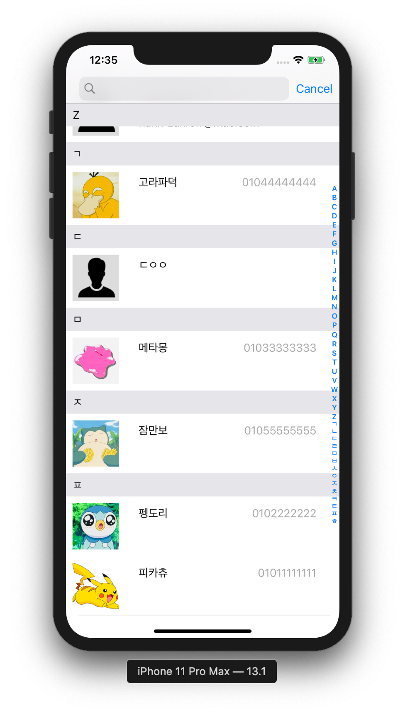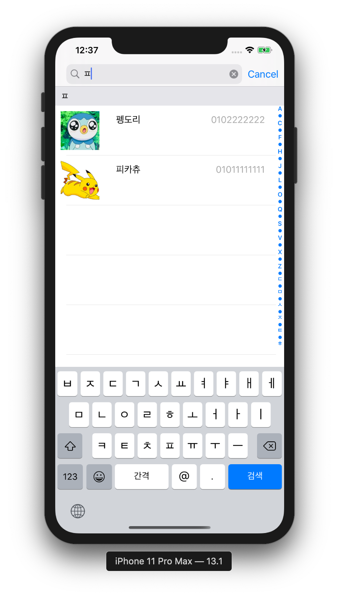
      

- **[iOS앱] 음료수 자판기 앱**
    - 소개
      
        - 음료수 자판기와 동일한 기능을 하는 앱 구현
        
    - 주요 기능
        - 금액 투입 / 음료수 구매를 표시하는 사용자 화면 구현
        - 재고 관리 / 판매 이력을 표시하는 관리자 화면 구현
        - 객체들(음료수 재고, 잔액등)의 현재 상태 저장 / 복원
        
    - 개발 범위
        - [콘솔]음료수 자판기 프로젝트의 뷰를 제외한 코드를 그대로 가져와서 구현
        - 객체 직렬화와 UserDefaults를 이용해 영속성 구현
        - 모델의 로드(객체 언아카이빙)와 뷰의 초기화 시점의 불일치를 NotificationCenter를 이용하여 해결
        - Core Graphics으로 판매 이력을 그래프로 표현
        
    - 개발 언어
    
        - Swift
    
    - GitHub 저장소
    
        - [https://github.com/O-O-wl/vendingmachine-app](https://github.com/O-O-wl/vendingmachine-app)
        
    - 실행 화면
    
        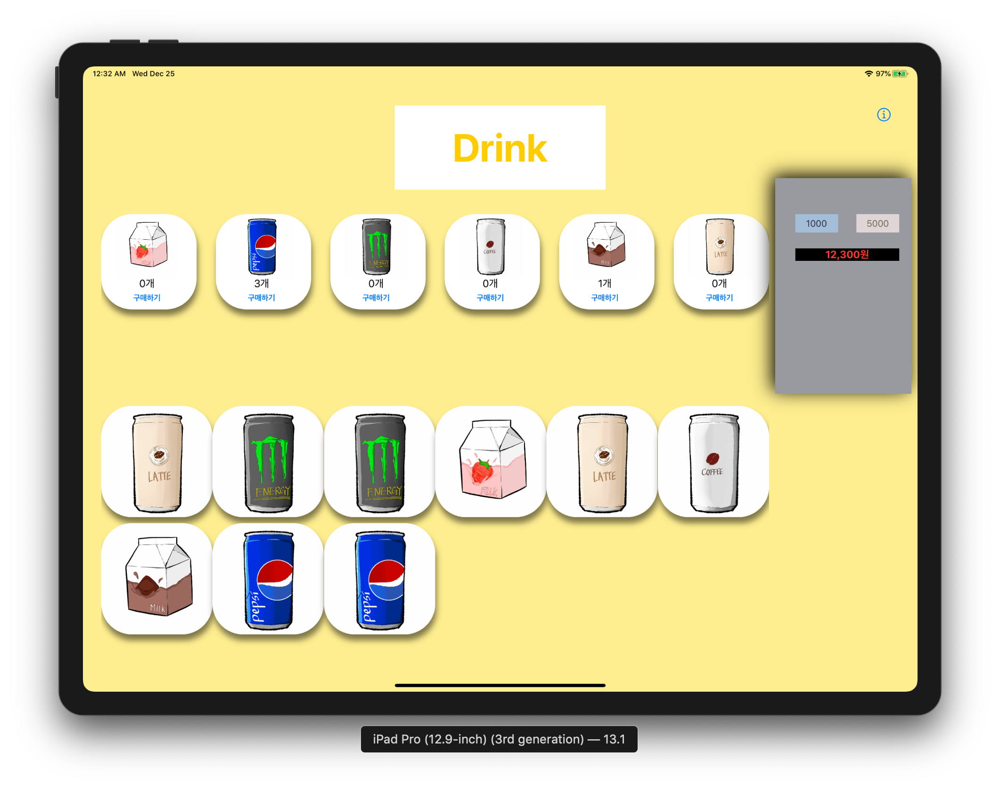
        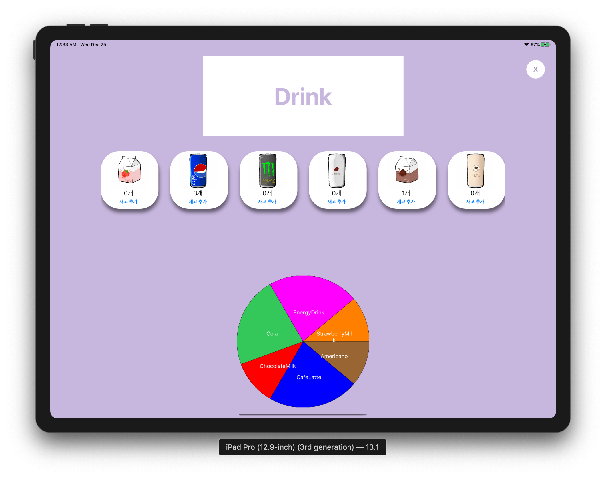
    
- **[iOS앱] 애플 기본 날씨 카피 앱**
    - 소개
      
        - 애플 기본 날씨 앱을 참고하여 만든 날씨 앱
    - 주요 기능
        - API에서 오는 데이터를 화면에 맞는 데이터로 포맷팅
        - 관심 도시의 날씨를 화면에 표시
        - 관심 도시 데이터 저장 / 복원
    - 개발 범위
        - DarkSky-API에서 오는 수치를 앱 내에서 사용할 타입(Temperature/Wind/UV등)으로 변환하여 구현했습니다.
        - WeatherDetailViewController의 경우 CollectionView와 TableView를 모두 표시하여 ViewController가 커지는 것을 우려하여, 해당 DataSource & Delegate를 분리하여 구현했습니다.
        - 타이머를 이용한 날씨 업데이트 구현했습니다.
    - 개발 언어
      
        - Swift
    - GitHub 저장소
    
        - [https://github.com/O-O-wl/WeatherEverywhere](https://github.com/O-O-wl/WeatherEverywhere)
- 실행 화면
  
    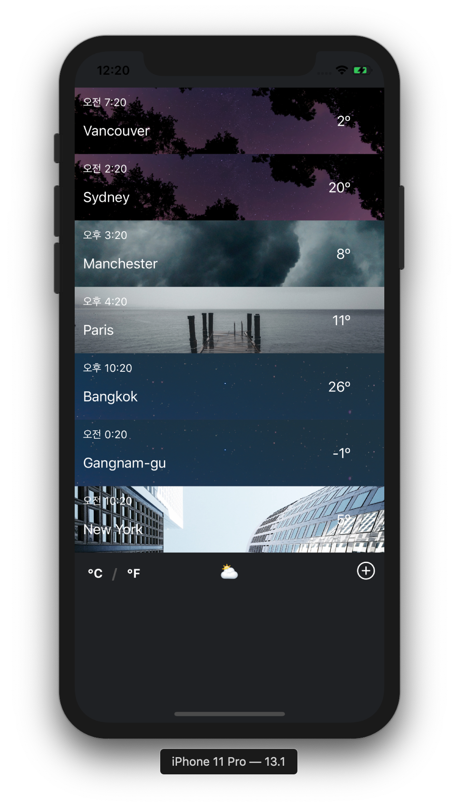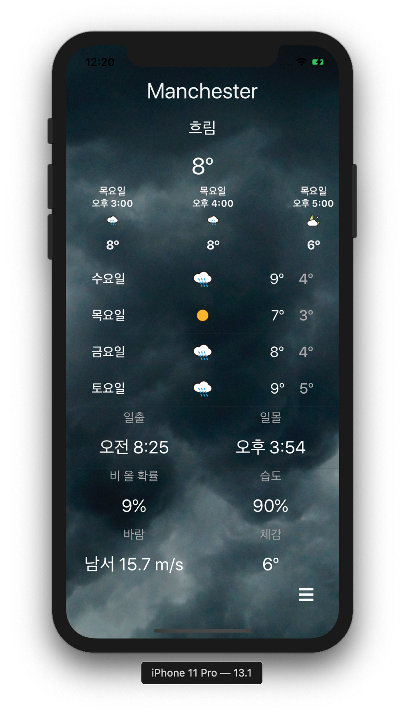
    
- **[iOS앱] 작은 고양이 톡**
  
    - 소개
        - 친구와 대화, 미디어 공유가 가능한 채팅 앱(교내 프로젝트)
        - 첫 iOS 앱
    - 주요 기능
        - 친구 검색 / 추가
        - 대화상대와의 실시간 채팅
        - 대화상대와의 사진미디어 공유
    - 개발 범위
        - 기간과 시간을 고려하여 라이브러리를 이용했습니다.
        - NameSpace → Room 에 접속하여, 해당 공간에 접속한 소켓끼리만 통신하게 구현했습니다.
        - 클라이언트 → 서버로의 요청(이미지 업로드, 채팅 전송)은 HTTP로 요청했습니다
        - 서버에서 받은 요청을 처리한 후, 동일한 Room에 있는 소켓들에게 이벤트를 emit해여, 양방향 통신을 구현했습니다.
    - 라이브러리
        - Alamofire
        - Socket.io
    - 개발 언어
        - Swift
        - JavaScript
    - GitHub 저장소
      
    - [https://github.com/smallcattalk/small-cat-talk](https://github.com/smallcattalk/small-cat-talk)
    - 실행 화면

        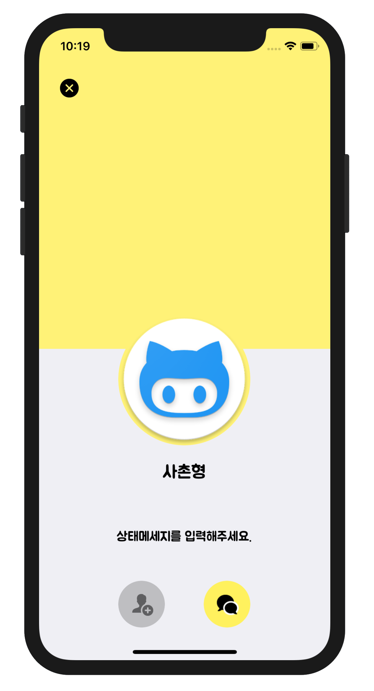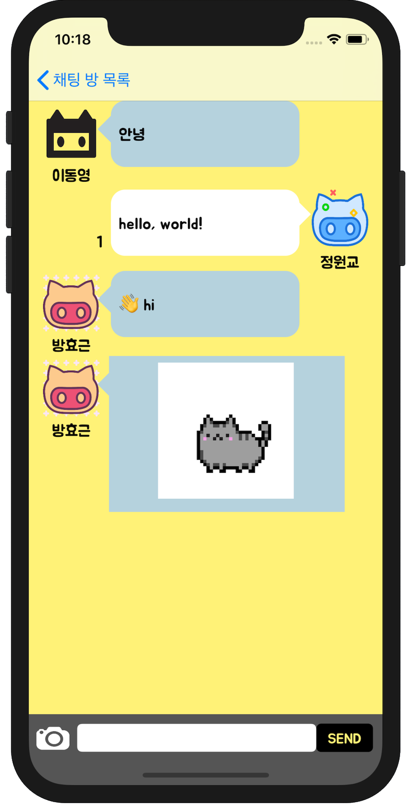

- **[라이브러리] AttriBeauty**
    - 소개
      
        - NSAttributedString을 선언적인 방법으로 사용할 수 있게 만들어주는 라이브러리
- 주요 기능
  
            // 기존 표현
            demoString.addAttribute(NSAttributedString.Key.foregroundColor,
            											  value: UIColor.red, 
            											  range: NSRange(0...4)
            demoString.addAttribute(NSAttributedString.Key.font,
            										 value: .boldSystemFont(ofSize: 30))
    
        - 메소드 체이닝을 활용한 NSAttributedString 표현식 제공
        - `[NSAttributedString.Key: Any]` 보다 타입이 명시적인 방식의 표현식 구현
    - 라이브러리
        - inspired by SnapKit
        - inspired by Then
    - 개발 언어
      
        - Swift
    - GitHub 저장소
    
        - [https://github.com/O-O-wl/AttriBeauty](https://github.com/O-O-wl/AttriBeauty)
    - 사용법
    
            @IBOutlet var demoLabel: UILabel!
            
            demoLabel.attributedText = demoLabel.text?
                        .beautfiy()
                        .attriBeauty
                        .fgColor(.blue)
                        .bgColor(.green).regex("awesome")
                        .fgColor(.red).range(NSRange(0...4))
                    .font(.boldSystemFont(ofSize: 30))
                        .align(.center)
                    .apply()
    
        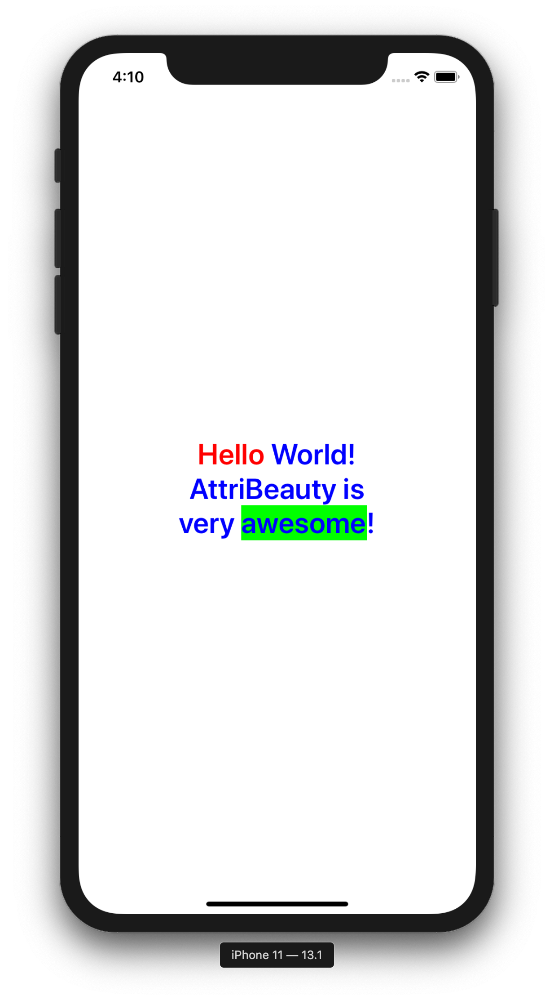
    
- **[라이브러리] SwiftAction**
    - 소개
      
        - Target-Action을 Swifty하게 만들어주는 라이브러리
- 주요 기능
  
        ```swift
        // 기존 표현
        button.addTarget(self,
        							   action: #selector(changeColorToBlue(_:)),
        								 for: touchUpInside)
        
        @objc 
        func changeColorToBlue(_ sender: UIButton) {
        	 sender.backgroundColor = .blue
    }
        ```
        
        - 기존 표현과는 달리 액션 메소드의 구현과 주입이 한곳에서 이루어져 보다 이해하기 쉬운 코드를 작성 가능
        - 클로저를 주입하여 Swift스러운 표현으로 액션을 추가할 수 있게 구현
    - 개발 언어
      
    - Swift
    - GitHub 저장소
      
        - [https://github.com/O-O-wl](https://github.com/O-O-wl/SwiftAction)/SwiftAction
    - 사용법
    
        ```swift
        @IBOutlet var button: UIButton!
        
        // addAction
        button.addAction(for: .touchUpInside) {
               $0.backgroundColor = .blue
        }
           
        button.addAction(for: .touchDragInside,
        								 action: buttonDragInside)
        
        // removeAction
        button.removeAction(for: .touchUpInside)
        ```
    
- **[콘솔] 음료수 자판기**
    - 소개
        - 음료수 자판기와 동일한 기능을 하는 콘솔 프로젝트
    - 주요 기능
        - 금액 투입 / 음료수 구매를 표시하는 사용자 모드 제공
        - 재고 관리 / 판매 이력을 표시하는 관리자 모드 제공
    - 개발 범위
        - Beverage의 출력을 담당하는 OutputView에서 내부 데이터에 직접 접근하여, 출력문을 만들지 않고, 클로저(출력메서드)를 주입하여, 내부 데이터를 핸들링하게 구현했습니다.
    - 라이브러리
        - Swift Lint
    - 개발 언어
        - Swift
    - GitHub 저장소
        - [https://github.com/O-O-wl/swift-vendingmachine](https://github.com/O-O-wl/swift-vendingmachine)
    - 실행 화면

    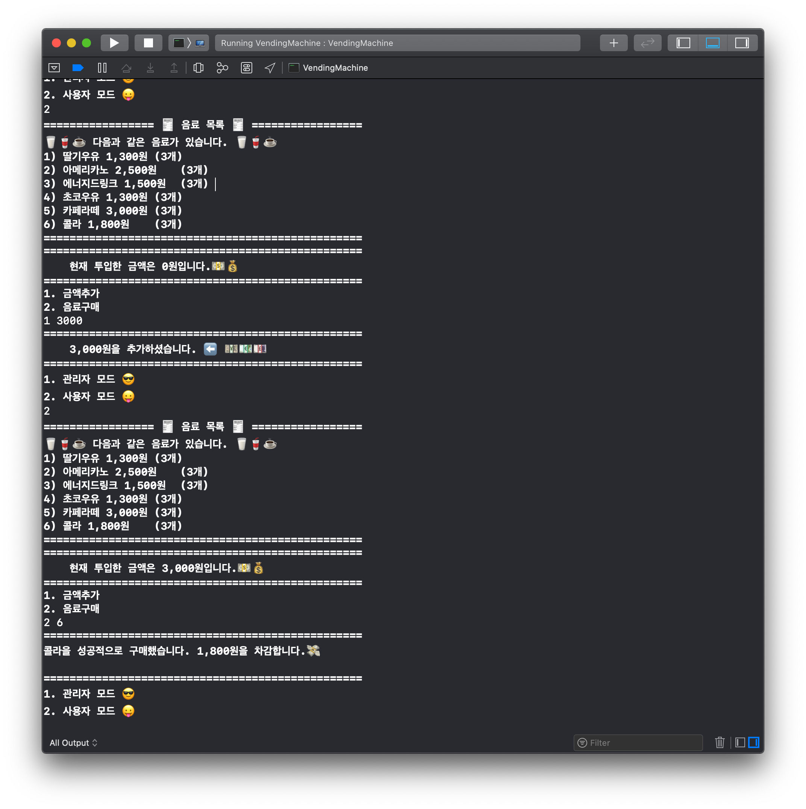

- **[콘솔] 카드 게임**
    - 소개
      
        - Texas Holdem 규칙에 따르는 카드 게임 콘솔 프로젝트
    - 주요 기능
        - 5카드, 7카드 게임을 제공
        - 카드 핸드의 조합 계산
        - 게임 플레이어간의 게임 승패 결정
    - 개발 범위
        - Player간의 대소(승패)비교 시, 다른 Player의 데이터를 가져와서 비교하는 대신 Comparable을 구현하여, 비교의 결과만을 반환하게 구현하여, 객체의 내부 데이터와 관련된 연산을 최대한 내부에서 처리하게 구현했습니다.
        - Comparable과 유사한 Pairable/Linkable 프로토콜로 페어 가능성, 스트레이트 가능성을 내부에서 판단할 수 있게 구현했습니다.
    - 개발 언어
      
        - Swift
    - GitHub 저장소
    
        - [https://github.com/O-O-wl/swift-cardgame](https://github.com/O-O-wl/swift-cardgame)
- 실행 화면
  
        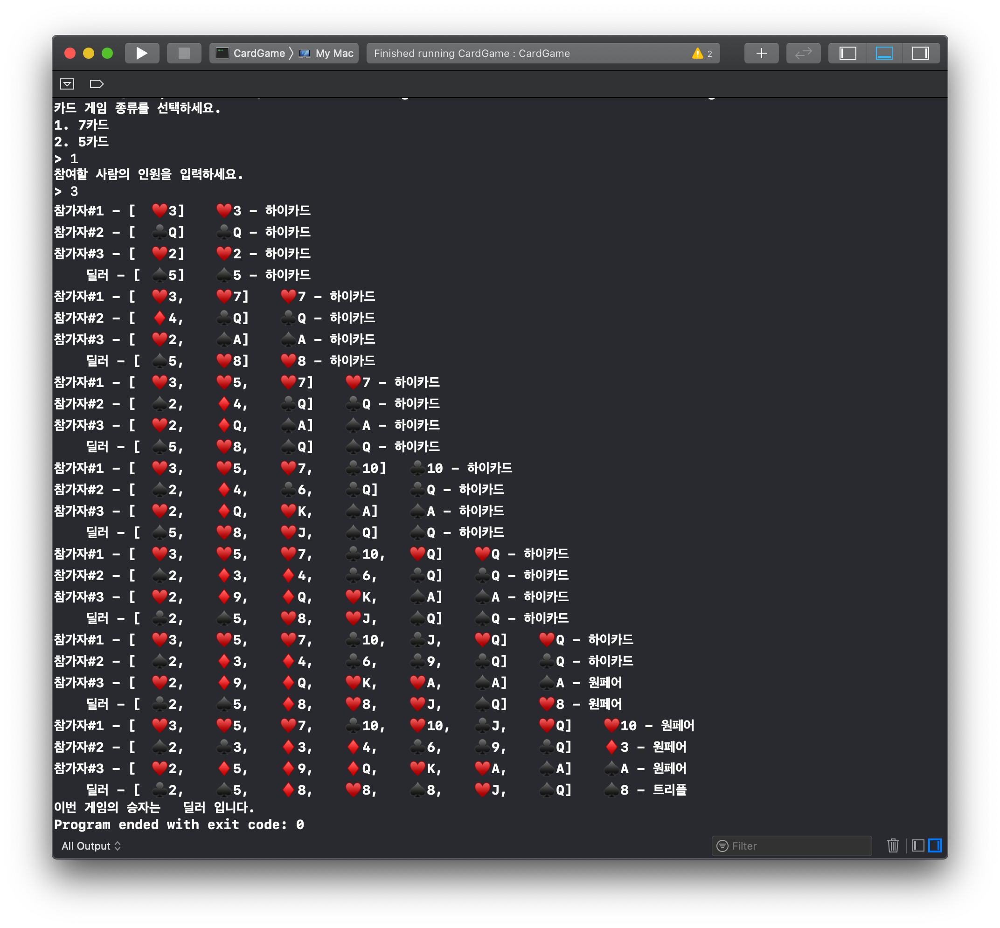
    
- **[콘솔] JSON 문자열 분석기**
    - 소개
      
        - JSON형태의 문자열을 입력받아 분석하는 콘솔 프로젝트
    - 주요기능
        - JSON형태의 문자열인지 검사
        - JSON형태의 문자열을 Array, Dictionary로 파싱
        - 변형한 Array, Dictionary를 분석하여 요소를 출력
        - JSON을 보기 좋은 형태로 출력
    - 개발 범위
        - [,{ 수를 세어 중첩된 컨테이너의 Depth 확인 후, 해당 Depth를 처리할 수 있는 Regex를 생성하여, 깊은 Depth의 문자열도 검사할 수 있게 구현했습니다.
        - 중첩 컨테이너를 처리함에 있어, 재귀호출을 하여 구현했습니다.
    - 개발 언어
      
        - Swift
    - GitHub 저장소
    
        - [https://github.com/O-O-wl/swift-jsonparser](https://github.com/O-O-wl/swift-jsonparser)
- 실행 화면
  
        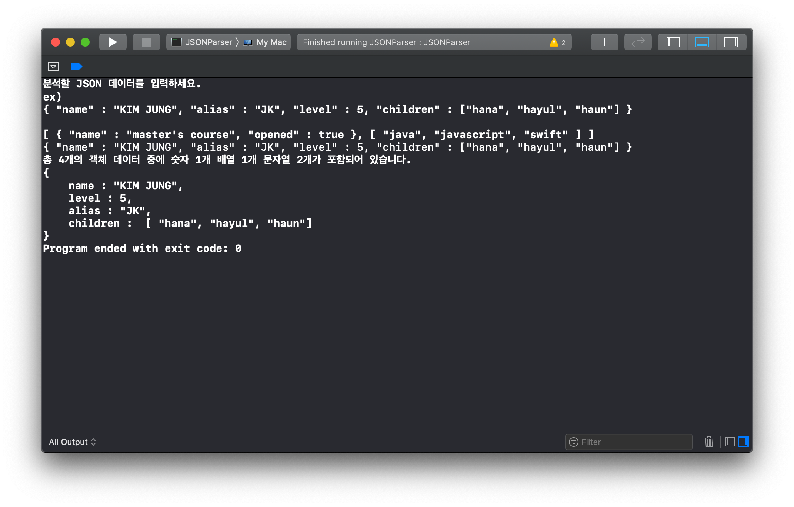
    
- **[콘솔] 좌표 계산기**
    - 소개
      
        - 좌표를 입력 받은 후, 콘솔 화면에 좌표와 도형, 관련 값을 표시하는 콘솔 프로젝트
    - 주요 기능
        - 좌표를 입력 받아 1개 - 점, 2개 - 선, 3개 - 삼각형, 4개 - 사각형등 도형을 표현
        - 도형과 도형과 관련된 값(선: 길이, 삼각형: 넓이 등)을 출력
    - 개발 범위
        - 좌표의 입력 형식을 검사를 Regex로 구현했습니다.
        - 요구사항의 변경에 따른 도형의 타입이 추가되어, 타입 추가에 유연한 방식의 구현했습니다. 기존 (enum → protocol) enum Figure은 case가 추가될 때마다, 기존 switch문이 모두 수정되어야 했지만, Protocol Figure로 구현하니, 타입 확장이 기존의 코드를 변경 없이, 새로운 코드의 작성만으로 확장이 가능했습니다.
    - 개발 언어
      
        - Swift
    - GitHub 저장소
    
        - [https://github.com/O-O-wl/swift-coordinate](https://github.com/O-O-wl/swift-coordinate)
    - 실행 화면
    
        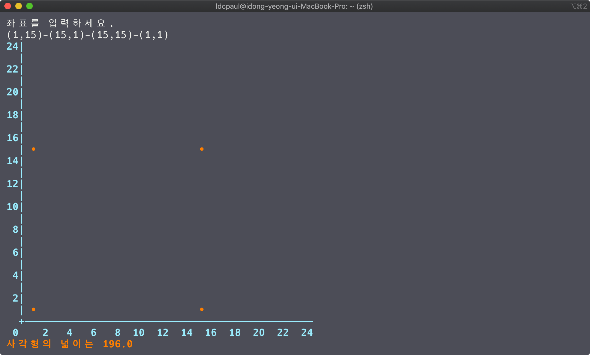

### 활동

- **MASH-UP**

    

    - 소개
        - 디자이너와 개발자가 함께 성장하는 앱 개발 동아리
    - 활동기간
        - 2019.09 ~
- **부스트 코스 에이스 2019**
    - 소개
        - 알찬 부스트코스 학습과 꼼꼼한 현업개발자의 코드리뷰를 통해 성장하는 기회
    - 활동기간
        - 2019.07 ~ 2019.10